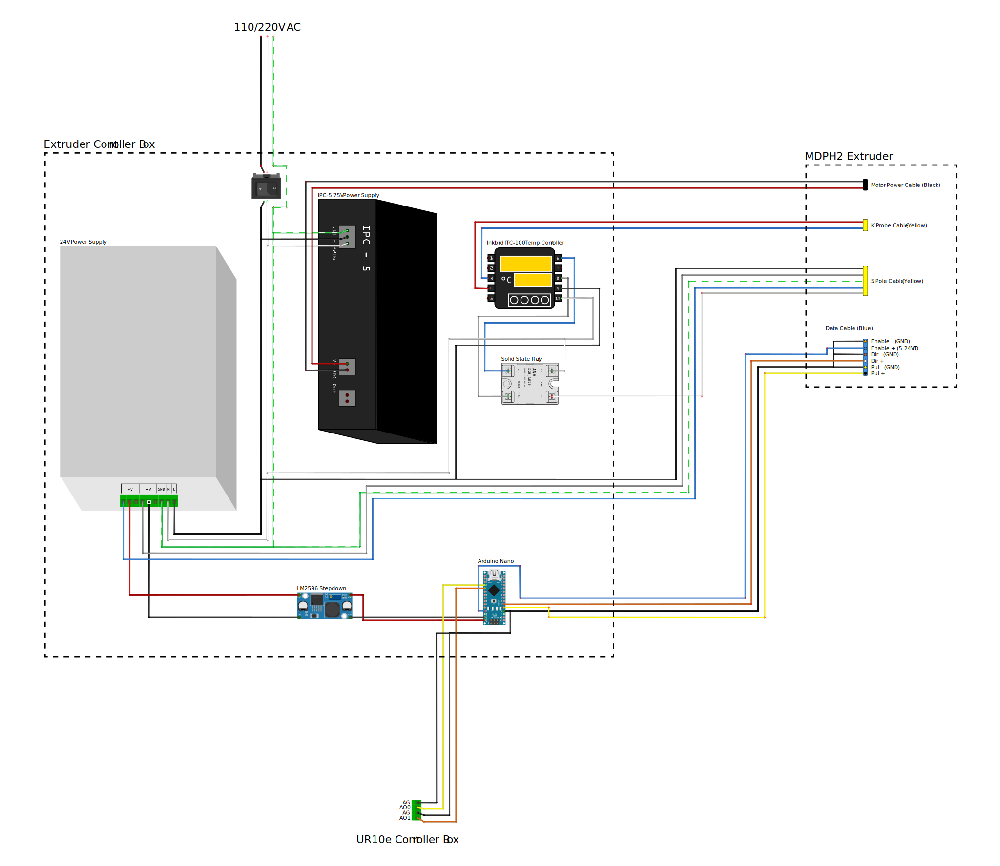

# MDPH2 on UR10e
###### A controller box and mounts to get started with the Massive Dimension thermoplastic extruder MDPH2 on UR10e

## Overview
This repository contains everyting needed to get started with robotic thermoplastic printing with the [MDPH2 from Massive Dimension](https://massivedimension.com/products/mdphe-v1-pellet-head-extruder-system) and the [Universal Robot UR10e](https://www.universal-robots.com/products/ur10-robot/) (or any UR model capable of handeling the weight).

Included in the repository are:

- Controller Box CAD Files: For 3D printing the structure and laser cutting the acrylic walls of the controller box,
- Mounts CAD Files: For 3d printing mounts to secure the clay tank, extruder, and pressure gauge,
- Scripts: Arduino code for the controller and Grasshopper toolpath example.

## Note on the Signal Workflow

The workflow begins with the Grasshopper script embedding the extrusion commands (rate and direction) into the URP file. This file instructs the UR10e to output two analog voltage signals (0-5V) on AO0 (Pul) and AO1 (Dir). These signals are read by the Arduino on pins A0 (Pul) and A1 (Dir), which translates them into digital signals on pins D2 (Pul) and D3 (Dir) for the ClearPath servo motor of the MDPH2.

**Grasshopper (Extrusion Command Embeded in URP file/G-Code ) ⟶ UR10e (Analog Output 0-5V) ⟶ Arduino (Analog Input) ⟶ MDPH2's Servo Motor (Digital Signal)**

Note: The temperature is not controlled by the Grasshopper script. The temperature must be set manually on the PID controller. Allow the extruder to warm up to the desired temperature before starting extrusion to prevent motor damage due to high torque.  
For PLA, we set the temperature to 190°C. It is recommended to stay on the lower end of the melting temperature spectrum to maintain high viscosity, reduce stringing, and minimize cooling time.

## Components

- Arduino Nano
- LM2596 Stepdown reducer 24v to 12v
- Rocker Switch
- Inkbird ITC-100 PID Temperature Controller (comes with the MDPH2)
- IPC-5 75v Power Supply (comes with the MDPH2)
- Solid State Relay (comes with the MDPH2)
- 24v Power Supply
- M3 and M4 Hex Socket Head Screws
- 3mm Acrylic Sheet
- Electrical Connectors (JST XH in our case)
- 18 and 24awg cables 

## Setup and Installation

### Prerequisites

- UR10e Robotic Arm (or any UR models),
- Massive Dimension MDPH2 Thermoplastic extruder,
- Rhino Grasshopper: For generating toolpath commands.

### Wiring Diagram

Refer to the following wiring diagram for the electrical connections.

Diagram made with the open-source tool [Fritzing](https://fritzing.org/).

### Controller Box and Mount CAD Files

- MDPH2 Extruder Mount 3D printing file,
- Structure 3D printing file. Skeleton inside de box holding all the components in place,
- Corner brackets 3D printing file,
- 3MM acrylic wall Laser cutting file.

### Scripts

#### Arduino Script: 

Upload the provided code (WASP_Extruder_Controller.ino) to the Arduino Nano. Ensure all connections are made according to the wiring diagram.

#### Grasshopper Definition

The [Robots](https://www.food4rhino.com/en/app/robots) plugin is necessary. The extrusion rate is set in RPM and is converted to steps per second with the following equation:
$$y = \left( \frac{x \times 800}{60} \right)$$
Where 800 represents the number of steps per revolution for the stepper motor, and 60 is used to convert minutes to seconds, resulting in the conversion of RPM (x) to steps per second (y).

The actual RPM can be checked through [ClearPath](https://www.teknic.com/files/downloads/motor_setup.zip) MSP via the micro USB cable on top of the servo motor.

## Contributing

Contributions are welcome! Please submit a pull request or open an issue to discuss any changes or improvements.

## License

[![CC BY-NC-SA 4.0][cc-by-nc-sa-shield]][cc-by-nc-sa]

This work is licensed under a
[Creative Commons Attribution-NonCommercial-ShareAlike 4.0 International License][cc-by-nc-sa].

[![CC BY-NC-SA 4.0][cc-by-nc-sa-image]][cc-by-nc-sa]

[cc-by-nc-sa]: http://creativecommons.org/licenses/by-nc-sa/4.0/
[cc-by-nc-sa-image]: https://licensebuttons.net/l/by-nc-sa/4.0/88x31.png
[cc-by-nc-sa-shield]: https://img.shields.io/badge/License-CC%20BY--NC--SA%204.0-lightgrey.svg

## Acknowledgements

Special thanks to the teams and communities behind Rhino Grasshopper, Arduino, and Universal Robots for their support and resources.
